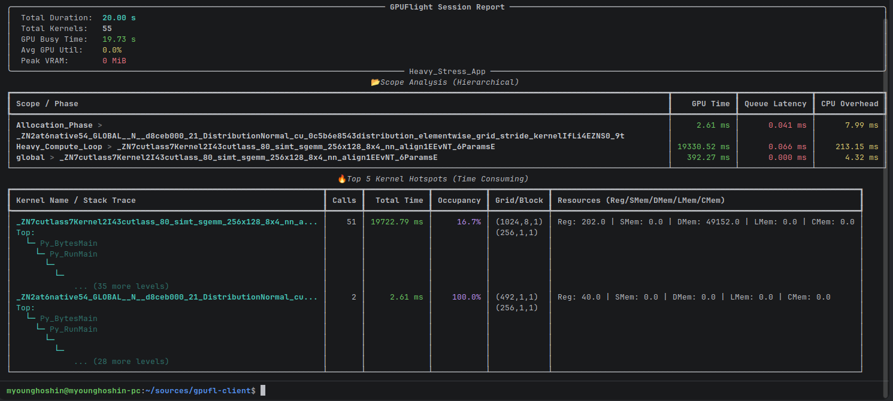

# GPUFlight Client Library (gpufl)

**The Flight Recorder for GPU Production Workloads.**

`gpufl` is a lightweight, high-performance C++ observability library designed for always-on monitoring of GPU applications.
Unlike traditional profilers (Nsight) that stop the world, GPUFlight is designed to run in production with minimal overhead, capturing kernel telemetry and logical scopes into structured logs.

## Project Status: Active Research & Development
GPU Flight is currently in an early **"Active Research"** phase. The core architecture and C++ engine are being rapidly iterated upon.

To ensure the integrity of the initial design, **we are not currently accepting major feature Pull Requests.** However, we welcome:
- Bug reports and local build issues.
- Documentation improvements and typo fixes.
- Feature requests and architectural suggestions via GitHub Issues.

**The Flight Recorder for GPU Production Workloads.**

## Live Demo

Try the portal with real session data — no sign-up required:

**[https://gpufl-front.vercel.app/demo/gdemo_4R98GA5MzYdosqvNsUqdp_MaUgEcDHABS2C5PHbCDQE](https://gpufl-front.vercel.app/demo/gdemo_4R98GA5MzYdosqvNsUqdp_MaUgEcDHABS2C5PHbCDQE)**

`gpufl` is a **low-overhead, always-on** C++ observability library for GPU applications. Built on CUPTI (NVIDIA) and rocprofiler-sdk (AMD), it captures kernel telemetry, SASS-level profiling, and system metrics with under 2% overhead in monitoring mode.
Unlike traditional profilers (Nsight) that stop the world with 20-200x slowdown, GPUFlight is designed to run continuously in production — capturing kernel telemetry and logical scopes into structured logs.

## Key Features

- **Kernel Monitoring**: Automatically intercepts all CUDA kernel launches via CUPTI.
- **Production Grade**: Uses a **Lock-Free Ring Buffer** and a **Background Collector Thread** to decouple logging from your hot path.
- **Logical Scoping**: Group thousands of micro-kernels into meaningful phases (e.g., "Inference", "PhysicsStep") using `GFL_SCOPE` or `gpufl.Scope`.
- **Rich Metadata**: Captures kernel names, grid/block dimensions, register counts, shared memory usage, occupancy with per-resource breakdown, and CPU stack traces.
- **Profiling Engines**: Choose from PC Sampling (stall analysis), SASS Metrics (instruction-level divergence), or Range Profiler (hardware counters) — one engine per session.
- **System Monitoring**: Collects GPU utilization, VRAM, temperature, power, and clock speeds via NVML.
- **Sidecar Ready**: Outputs structured NDJSON logs with automatic rotation and gzip compression.
- **Direct Upload**: Opt-in `remote_upload=True` mode POSTs telemetry straight to the GPUFlight backend — ideal for local dev, SSH, and Jupyter workflows where running the sidecar agent is overkill.
- **Vendor Agnostic Design**: Architecture ready for AMD (ROCm) support.

---

## Installation

### Python (PyPI)
```bash
pip install "gpufl[analyzer,viz]"
```

For full NVML support (GPU utilization/VRAM monitoring), build from source inside a CUDA devel container:
```bash
git clone https://github.com/gpu-flight/gpufl-client.git
CMAKE_ARGS="-DBUILD_TESTING=OFF" pip install "./gpufl-client[analyzer,viz]"
```

### C++ (CMake FetchContent)
```cmake
cmake_minimum_required(VERSION 3.31)
project(my_app LANGUAGES CXX CUDA)

include(FetchContent)
FetchContent_Declare(
    gpufl
    GIT_REPOSITORY https://github.com/gpu-flight/gpufl-client.git
    GIT_TAG        main
)
FetchContent_MakeAvailable(gpufl)

add_executable(my_app main.cu)
target_link_libraries(my_app PRIVATE gpufl::gpufl CUDA::cudart CUDA::cupti)
```

---

## Quick Start (Python + Docker)

The recommended way to get started is with a Docker container. See [example/python/docker/Dockerfile](example/python/docker/Dockerfile) for a ready-to-use setup with PyTorch and Jupyter Lab.

```bash
cd example/python/docker
docker build -t gpufl-python .
docker run --gpus all -p 8888:8888 -v $(pwd)/notebooks:/workspace gpufl-python
```

```python
import torch
import gpufl

gpufl.init("my-app",
           log_path="./my_logs",
           sampling_auto_start=True,
           enable_kernel_details=True,
           enable_stack_trace=True)

a = torch.randn(1024, 1024, device="cuda")
b = torch.randn(1024, 1024, device="cuda")
c = a @ b
torch.cuda.synchronize()

gpufl.shutdown()
```

---

## Profiling Engines

CUPTI only allows one profiling mode per CUDA context at a time. Choose an engine at init:

```python
from gpufl import ProfilingEngine

gpufl.init("my-app",
           log_path="./logs",
           profiling_engine=ProfilingEngine.PcSampling,
           enable_kernel_details=True)
```

| Engine | What it collects | Analyzer method | Best for |
|---|---|---|---|
| `PcSampling` | Warp stall reasons (statistical sampling) | `session.inspect_stalls()` | Finding *why* warps are stalling |
| `SassMetrics` | Per-instruction execution counts (binary instrumentation) | `session.inspect_profile_samples()` | Thread divergence detection |
| `RangeProfiler` | SM throughput, L1/L2 hit rates, DRAM bandwidth, tensor core % | `session.inspect_perf_metrics()` | Hardware counter deep-dives |
| `None` | Kernel metadata only (names, timing, occupancy) | `session.inspect_hotspots()` | Production monitoring with minimal overhead |

### C++ Usage

```cpp
gpufl::InitOptions opts;
opts.app_name = "my_app";
opts.log_path = "my_logs";
opts.enable_kernel_details = true;
opts.enable_stack_trace = true;
opts.sampling_auto_start = true;
opts.profiling_engine = gpufl::ProfilingEngine::SassMetrics;

gpufl::init(opts);

GFL_SCOPE("training_step") {
    // your CUDA code here
}

gpufl::shutdown();
```

---

## Talking to the Backend

`gpufl` can optionally interact with the GPUFlight backend in two
independent ways, both opt-in:

| Capability | Opt in via | What happens |
|---|---|---|
| **Fetch remote named config** | `config_name="..."` | `gpufl.init()` does a one-off `GET /api/v1/config?config=<name>` before monitoring starts and applies the returned fields to your `InitOptions`. |
| **Direct log upload** | `remote_upload=True` | A background thread POSTs every NDJSON line to `/api/v1/events/<type>` in parallel with the on-disk write. Intended for local / SSH / Jupyter workflows. |

Both require `backend_url` + `api_key` to be set. **Setting those two
fields alone does nothing** — you must opt into at least one of the
two capabilities above.

### Configuration precedence

When multiple sources set the same field, higher beats lower:

```
5. The kwargs you pass to gpufl.init()            ← highest
4. Env vars (GPUFL_BACKEND_URL, GPUFL_API_KEY, ...)
3. Local config file (config_file=...)
2. Remote named config (when config_name is set)
1. Built-in defaults                              ← lowest
```

### Quick start

```python
import gpufl

# Just live upload — no remote config fetch
gpufl.init("my_app",
           log_path="./logs",
           backend_url="https://api.gpuflight.com",
           api_key="gpfl_xxxxxxxxxxxx",
           remote_upload=True)

# Just remote config fetch — no upload (production uses the sidecar)
gpufl.init("my_app",
           backend_url="https://api.gpuflight.com",
           api_key="gpfl_xxxxxxxxxxxx",
           config_name="production")

# Both
gpufl.init("my_app",
           backend_url="https://api.gpuflight.com",
           api_key="gpfl_xxxxxxxxxxxx",
           config_name="production",
           remote_upload=True)
```

Or via environment:

```bash
export GPUFL_BACKEND_URL=https://api.gpuflight.com
export GPUFL_API_KEY=gpfl_xxxxxxxxxxxx
export GPUFL_CONFIG_NAME=production     # opt into remote config
export GPUFL_REMOTE_UPLOAD=1            # opt into live upload
python my_training_script.py
```

### Upload mechanics

- The client writes NDJSON to disk as usual AND POSTs each line in
  parallel via a dedicated background thread — no added latency on the
  measurement hot path.
- Best-effort delivery: 3 retries with exponential backoff per line,
  then drop. The on-disk NDJSON is still there, so a monitor daemon
  (or manual re-upload) can always back-fill.
- An invalid or unauthorized API key disables live upload for the
  session; the file sink keeps working.

For production workloads with guaranteed delivery, pipe delivery, or
cross-process fan-in, keep using the `gpufl-monitor` sidecar agent —
it's the same NDJSON on the wire, just decoupled from the measurement
process.

---

## Python Analysis

The `gpufl.analyzer` module loads NDJSON logs and provides Rich-formatted terminal dashboards.

```python
from gpufl.analyzer import GpuFlightSession

session = GpuFlightSession("./logs", log_prefix="my_logs")

# Executive Summary: session duration, kernel count, GPU utilization, VRAM
session.print_summary()

# Top kernels by GPU time with occupancy breakdown and stack traces
session.inspect_hotspots(top_n=5)

# Time breakdown by user-defined Scope regions
session.inspect_scopes()

# PC Sampling: per-kernel stall reason distribution
session.inspect_stalls(top_n=10)

# SASS Metrics: instruction-level execution counts and divergence
session.inspect_profile_samples(top_n=10)

# Range Profiler: SM throughput, cache hit rates, DRAM bandwidth
session.inspect_perf_metrics(top_n=10)
```



### Visualization (Timeline)
The `viz` module provides interactive `matplotlib` plots to correlate kernel execution with system metrics.

```python
import gpufl.viz as viz

viz.init("./logs/*.log")
viz.show()
```

---

## Testing

### C++ Tests
The C++ tests use GoogleTest and are hardware-aware — NVIDIA-specific tests skip automatically if no compatible GPU is detected.

```bash
cmake --build cmake-build-debug --target gpufl_tests
ctest --test-dir cmake-build-debug --output-on-failure
```

### Python Tests
```bash
pip install pytest
pytest tests/python/
```

---

## Linux Configuration (Required for CUPTI)

To allow non-root users to profile GPU kernels (using CUPTI/PC Sampling) on Linux, you must relax the NVIDIA driver security restrictions. Without this, `gpufl` may fail to capture kernel activity.

1. **Create a configuration file:**
   ```bash
   sudo nano /etc/modprobe.d/nvidia-profiler.conf
   ```

2. **Add the following line:**
   ```
   options nvidia NVreg_RestrictProfilingToAdminUsers=0
   ```

3. **Apply changes and reboot:**
   ```bash
   sudo update-initramfs -u
   sudo reboot
   ```

---

*GPU Flight is open source: [github.com/gpu-flight](https://github.com/gpu-flight)*
*Python package: [pypi.org/project/gpufl](https://pypi.org/project/gpufl/)*
