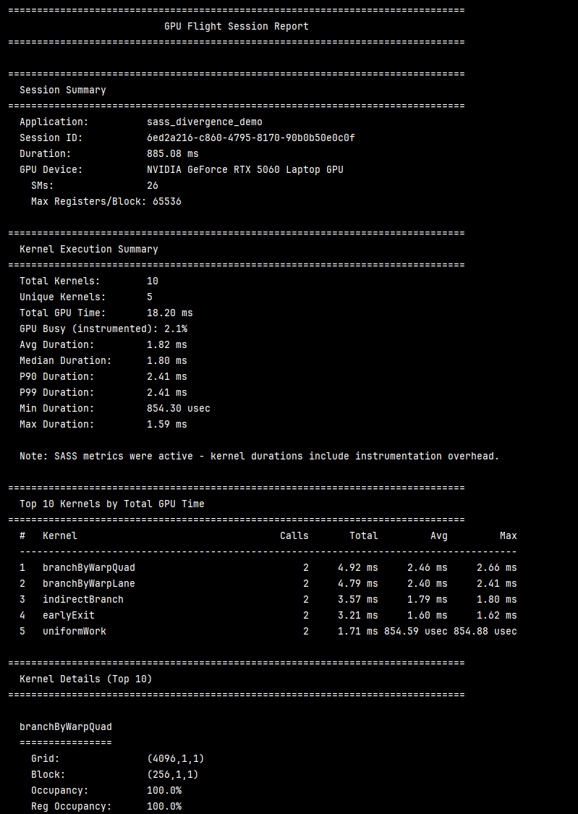

# GPUFlight Client Library (gpufl)

GPUFlight Client is an open-source CUDA and ROCm/HIP profiling client for collecting GPU profiling and monitoring data from inside your application.

It records GPU workload activity such as kernel launches, GPU metrics, logical scopes, and optional low-level profiling data into local NDJSON logs. You can analyze those logs locally, generate reports, or stream them to the GPUFlight dashboard.

The goal is to make GPU profiling lighter and more continuous, closer to observability rather than only one-time profiling.

Built on CUPTI for NVIDIA GPUs and rocprofiler-sdk for AMD GPUs, GPUFlight is designed for always-on monitoring with low overhead in monitoring mode.

## Project Status: 1.1.0

GPUFlight is published to PyPI; the current release is
`v1.1.0`. **Breaking changes vs 1.0.x** — `remote_upload` /
`HttpLogSink` removed (upload moves to a post-shutdown step), and
`sampling_auto_start` renamed to `continuous_system_sampling`. See
[CHANGELOG.md](./CHANGELOG.md) for the full migration notes. Pin an
exact version if you depend on it.

To keep the initial design coherent, **we are not currently accepting major feature Pull Requests.** However, we welcome:
- Bug reports and local build issues.
- Documentation improvements and typo fixes.
- Feature requests and architectural suggestions via GitHub Issues.

## Live Demo

Try the portal with real session data — no sign-up required:

**[Demo Link](https://demo.gpuflight.com)**

## Key Features

- **Kernel Monitoring**: Automatically intercepts all CUDA kernel launches via CUPTI.
- **Production Grade**: Uses a **Lock-Free Ring Buffer** and a **Background Collector Thread** to decouple logging from your hot path.
- **Logical Scoping**: Group thousands of micro-kernels into meaningful phases (e.g., "Inference", "PhysicsStep") using `GFL_SCOPE` or `gpufl.Scope`.
- **Rich Metadata**: Captures kernel names, grid/block dimensions, register counts, shared memory usage, occupancy with per-resource breakdown, and CPU stack traces.
- **Profiling Engines**: Choose from PC Sampling (stall analysis), SASS Metrics (instruction-level divergence), or Range Profiler (hardware counters) — one engine per session.
- **System Monitoring**: Collects GPU utilization, VRAM, temperature, power, and clock speeds via NVML.
- **Sidecar Ready**: Outputs structured NDJSON logs with automatic rotation and gzip compression.
- **Deferred Upload**: After a session ends, ship its NDJSON files to the GPUFlight backend with one call (`gpufl.upload_logs(...)`) or the orchestrated `with gpufl.session(backend_url=..., api_key=...):` context manager. All HTTP happens post-shutdown, so transient network failures cannot affect your GPU workload. Ideal for local dev, SSH, and Jupyter — no sidecar needed.
- **Vendor Agnostic Design**: Architecture ready for AMD (ROCm) support.

---

## Installation

### Python (PyPI)
```bash
pip install "gpufl[analyzer,viz]"
```

For full NVML support (GPU utilization/VRAM monitoring), build from source inside a CUDA devel container:
```bash
git clone https://github.com/gpu-flight/gpufl-client.git
CMAKE_ARGS="-DBUILD_TESTING=OFF" pip install "./gpufl-client[analyzer,viz]"
```

### Build Scripts

The repository includes platform-specific helper scripts for local source
builds. Use these scripts when you need to build against a specific CUDA
Toolkit, Python virtual environment, or wheel ABI.

#### Ubuntu / Linux

`build.sh` is the Linux entrypoint. It delegates to `build-ubuntu.sh`.

```bash
# Install into the active Python environment
./build.sh

# Build a wheel into ./dist
./build.sh --wheel

# Use an explicit Python and CUDA Toolkit
./build-ubuntu.sh --wheel \
  --python .venv/bin/python \
  --cuda-root /usr/local/cuda-13.2
```

Useful options:

| Option | Meaning |
|---|---|
| `--install` | Install the package into the selected Python environment. This is the default. |
| `--wheel` | Build a wheel into `./dist` or `--wheel-dir`. |
| `--python PATH` | Python executable to use. Use your target virtual environment's Python when building wheels. |
| `--cuda-root PATH` | CUDA Toolkit root, for example `/usr/local/cuda-13.2`. |
| `--wheel-dir PATH` | Output directory for built wheels. |

#### Windows

Use `build-windows.ps1` from PowerShell. The script imports the Visual Studio
2022 `vcvars64.bat` environment when it can find it, then sets the CUDA and
CMake generator variables for the build.

```powershell
# Install into the active Python environment
powershell -ExecutionPolicy Bypass -File .\build-windows.ps1

# Build a wheel into .\dist
powershell -ExecutionPolicy Bypass -File .\build-windows.ps1 -Mode wheel

# Build a wheel for a specific Python venv and CUDA Toolkit
powershell -ExecutionPolicy Bypass -File .\build-windows.ps1 `
  -Mode wheel `
  -Python "C:\path\to\.venv\Scripts\python.exe" `
  -CudaPath "C:\Program Files\NVIDIA GPU Computing Toolkit\CUDA\v13.2"
```

Useful parameters:

| Parameter | Meaning |
|---|---|
| `-Mode install` | Install the package into the selected Python environment. This is the default. |
| `-Mode wheel` | Build a wheel into `.\dist` or `-WheelDir`. |
| `-Python PATH` | Python executable to use. Use the target virtual environment's Python so the wheel tag matches that environment, for example `cp313`. |
| `-CudaPath PATH` | CUDA Toolkit root. If omitted, the script checks `CUDA_PATH`, `CUDA_HOME`, then common CUDA 13.x install paths. |
| `-WheelDir PATH` | Output directory for built wheels. |
| `-NoVcVars` | Skip importing `vcvars64.bat` and use the current shell environment. |

Both platform scripts pass the current CMake options:

```text
BUILD_PYTHON=ON
BUILD_GPUFL_EXAMPLE=OFF
BUILD_TESTING=OFF
PYBIND11_FINDPYTHON=ON
GPUFL_ENABLE_NVIDIA=ON
GPUFL_ENABLE_AMD=OFF
CUDAToolkit_ROOT=<selected CUDA Toolkit>
CMAKE_CUDA_COMPILER=<selected nvcc>
```

### C++ (CMake FetchContent)
```cmake
cmake_minimum_required(VERSION 3.31)
project(my_app LANGUAGES CXX CUDA)

include(FetchContent)
FetchContent_Declare(
    gpufl
    GIT_REPOSITORY https://github.com/gpu-flight/gpufl-client.git
    GIT_TAG        v1.1.0   # pin a release tag — see the Releases page for the latest
)
FetchContent_MakeAvailable(gpufl)

add_executable(my_app main.cu)
target_link_libraries(my_app PRIVATE gpufl::gpufl CUDA::cudart CUDA::cupti)
```

---

## Quick Start (Python + Docker)

The recommended way to get started is with a Docker container. See [example/python/docker/Dockerfile](example/python/docker/Dockerfile) for a ready-to-use Numba + Jupyter Lab playground (the published `ghcr.io/gpu-flight/gpufl-jupyter:latest` image).

```bash
cd example/python/docker
docker build -t gpufl-jupyter .
docker run --gpus all -p 8888:8888 -v $(pwd)/notebooks:/workspace gpufl-jupyter
```

```python
import gpufl
from numba import cuda
import numpy as np

gpufl.init("my-app",
           log_path="./my_logs",
           continuous_system_sampling=True,
           enable_stack_trace=True)

@cuda.jit
def add(a, b, out):
    i = cuda.grid(1)
    if i < out.size:
        out[i] = a[i] + b[i]

n = 1 << 20
a = cuda.to_device(np.random.rand(n).astype(np.float32))
b = cuda.to_device(np.random.rand(n).astype(np.float32))
out = cuda.device_array(n, dtype=np.float32)
add[(n + 255) // 256, 256](a, b, out)
cuda.synchronize()

gpufl.shutdown()
```

---

## Profiling Engines

CUPTI only allows one profiling mode per CUDA context at a time. Choose an engine at init:

```python
from gpufl import ProfilingEngine

gpufl.init("my-app",
           log_path="./logs",
           profiling_engine=ProfilingEngine.PcSampling)
```

| Engine | What it collects | Analyzer method | Best for |
|---|---|---|---|
| `Monitor` | GPU/host health metrics only; no CUPTI activity tracing | Text report / dashboard | Lowest-overhead production monitoring |
| `Trace` | Kernel, memcpy/memset, and synchronization activity: names, timing, streams, grid/block metadata | `session.inspect_hotspots()` | Understanding what ran and how long it took |
| `PcSampling` | Warp stall reasons (statistical sampling) | `session.inspect_stalls()` | Finding *why* warps are stalling |
| `SassMetrics` | Per-instruction execution counts (binary instrumentation) | `session.inspect_profile_samples()` | Thread divergence and instruction-level behavior |
| `PmSampling` | Time-series hardware counter samples from CUPTI PM Sampling | `session.inspect_pm_sampling()` | Hardware-counter timelines by scope |
| `RangeProfiler` | SM throughput, L1/L2 hit rates, DRAM bandwidth, tensor core % | `session.inspect_perf_metrics()` | Hardware counter deep-dives |
| `Deep` | Deep decision pipeline: SASS first, PC-sampling fallback, PM Sampling when available | Text report plus profiling analyzer views | Single-run deep profiling with safe defaults |

### C++ Usage

```cpp
gpufl::InitOptions opts;
opts.app_name = "my_app";
opts.log_path = "my_logs";
opts.enable_stack_trace = true;
opts.continuous_system_sampling = true;
opts.profiling_engine = gpufl::ProfilingEngine::SassMetrics;

gpufl::init(opts);

GFL_SCOPE("training_step") {
    // your CUDA code here
}

gpufl::shutdown();
```

---

## Talking to the Backend

`gpufl` writes NDJSON to disk during a session. To get those events to
the GPUFlight dashboard, call `gpufl.upload_logs(...)` (or the
orchestrated `with gpufl.session(...)`) **after `gpufl.shutdown()` has
returned**. Every byte of HTTP traffic happens post-shutdown, so
network failures cannot affect your GPU workload.

### Configuration precedence

When multiple sources set the same field, higher beats lower:

```
4. The kwargs you pass to gpufl.init() / upload_logs()  ← highest
3. Env vars (GPUFL_BACKEND_URL, GPUFL_API_KEY, ...)
2. Local config file (config_file=...)
1. Built-in defaults                                    ← lowest
```

### Quick start — orchestrated

```python
import gpufl

with gpufl.session(
    app_name="my_app",
    log_path="./logs",
    backend_url="https://api.gpuflight.com",
    api_key="gpfl_xxxxxxxxxxxx",
):
    train_one_epoch()
# On __exit__: gpufl.shutdown() runs, then gpufl.upload_logs() — automatically.
```

### Quick start — explicit

```python
import gpufl

gpufl.init("my_app", log_path="./logs",
           backend_url="https://api.gpuflight.com",
           api_key="gpfl_xxxxxxxxxxxx")
train_one_epoch()
gpufl.shutdown()

# Ship the session you just ran (default = latest).
result = gpufl.upload_logs(
    log_path="./logs",
    backend_url="https://api.gpuflight.com",
    api_key="gpfl_xxxxxxxxxxxx",
)
if not result.success:
    for w in result.warnings:
        print(f"WARN: {w}")
```

### CLI — `gpufl upload`

`upload` is a subcommand of the native `gpufl` binary (the same tool as
`gpufl trace`). For post-mortem recovery or one-off ad-hoc shipping:

```bash
gpufl upload ./logs \
    --backend-url https://api.gpuflight.com \
    --api-key gpfl_xxxxxxxxxxxx

# Specific session
gpufl upload ./logs --session-id <uuid> --backend-url ... --api-key ...

# Batch every session in the dir
gpufl upload ./logs --all-sessions --backend-url ... --api-key ...

# Re-upload after the cursor marked it done
gpufl upload ./logs --force --backend-url ... --api-key ...
```

> The native `gpufl` binary is **Linux-only**. On Windows/macOS (or any
> machine without the binary), the same uploader is available cross-platform
> through the Python package:
>
> ```bash
> python -m gpufl.cli upload ./logs --backend-url ... --api-key ...
> ```
>
> Up to v1.1.0rc2 this shipped as a `gpufl` pip console-script; it was
> consolidated into the native binary so a single command owns the `gpufl`
> name. The in-process `gpufl.upload_logs()` API is unchanged.

Env vars `GPUFL_BACKEND_URL` / `GPUFL_API_KEY` are accepted in place of
the flags.

### Upload mechanics

- The client writes NDJSON to disk during the session — that's the
  source of truth. **No HTTP runs during the workload.**
- `gpufl.upload_logs(...)` streams the files, POSTs each event to
  `/api/v1/events/<type>`, and writes a cursor file
  (`.gpufl-upload-cursor.json`) recording which sessions completed.
  Re-running it refuses to re-upload an already-completed session
  unless `force=True` (CLI: `--force`).
- Failure handling: one quick retry per POST, total 5-minute budget
  by default. Returns a `UploadResult` with `.success` and any
  `.warnings` — never throws on network errors.

For production fleets, the standalone `gpufl-agent` JVM service tails
the same NDJSON files and uploads in compressed batches — it's the
recommended path when many GPUs are emitting concurrently.

---

## Python Analysis

The `gpufl.analyzer` module loads NDJSON logs and provides Rich-formatted terminal dashboards.

```python
from gpufl.analyzer import GpuFlightSession

session = GpuFlightSession("./logs", log_prefix="my_logs")

# Executive Summary: session duration, kernel count, GPU utilization, VRAM
session.print_summary()

# Top kernels by GPU time with occupancy breakdown and stack traces
session.inspect_hotspots(top_n=5)

# Time breakdown by user-defined Scope regions
session.inspect_scopes()

# PC Sampling: per-kernel stall reason distribution
session.inspect_stalls(top_n=10)

# SASS Metrics: instruction-level execution counts and divergence
session.inspect_profile_samples(top_n=10)

# Range Profiler: SM throughput, cache hit rates, DRAM bandwidth
session.inspect_perf_metrics(top_n=10)
```


### Visualization (Timeline)
The `viz` module provides interactive `matplotlib` plots to correlate kernel execution with system metrics.

```python
import gpufl.viz as viz

viz.init("./logs/*.log")
viz.show()
```

---

## Report Generation

For a quick, shareable text summary of a session — session metadata, kernel
hotspots, duration percentiles, and system metrics — generate a **text report**.
It's the fastest way to see "what happened" without opening the dashboard, and
it drops cleanly into CI logs, PR comments, or a plain terminal.



The report includes:
- **Session Summary** — app name, session ID, duration, GPU device + SM count.
- **Capture Capabilities** — requested/selected engine and per-feature status,
  including `on, no data` when PM Sampling or another requested feature was
  enabled but produced no rows.
- **Kernel Execution Summary** — total / unique kernels, GPU-busy %, and
  duration statistics (avg / median / P90 / P99 / min / max). When a SASS
  profiling engine was active, kernel durations include instrumentation
  overhead and the report labels them accordingly.
- **Top kernels by total GPU time** — with per-kernel call counts.
- **Per-kernel details** — grid/block dimensions, occupancy, registers,
  shared memory (static + dynamic), register spills, and Waves/SM.
- **PM Sampling Summary** — total samples, metric averages/peaks, and top
  scopes when `pm_sample_batch` rows are present.

### From C++

Call `generateReport()` after `shutdown()` — it reads the NDJSON logs written
during the session:

```cpp
gpufl::init(opts);
// ... your CUDA / HIP work ...
gpufl::shutdown();

gpufl::generateReport();               // print to stdout
gpufl::generateReport("report.txt");   // or save to a file
```

### From Python

```python
from gpufl.report import generate_report

# Print the report — wrap in print() so newlines render. In a Jupyter
# notebook this also keeps the table columns aligned (stdout renders in
# a monospace font). A bare `generate_report(...)` as a cell's last
# expression shows an escaped one-line string, so always print() it.
text = generate_report("./logs", log_prefix="my_app", top_n=10)
print(text)

# Or save it straight to a file
generate_report("./logs", log_prefix="my_app", top_n=10, output_path="report.txt")
```

The Python version reads the same NDJSON logs the analyzer uses — no GPU
required, so you can generate reports from logs copied off another machine.

---

## Testing

### C++ Tests
The C++ tests use GoogleTest and are hardware-aware — NVIDIA-specific tests skip automatically if no compatible GPU is detected.

```bash
cmake --build cmake-build-debug --target gpufl_tests
ctest --test-dir cmake-build-debug --output-on-failure
```

### Python Tests
```bash
pip install pytest
pytest tests/python/
```

---

## Linux Configuration (Required for CUPTI)

To allow non-root users to profile GPU kernels (using CUPTI/PC Sampling) on Linux, you must relax the NVIDIA driver security restrictions. Without this, `gpufl` may fail to capture kernel activity.

1. **Create a configuration file:**
   ```bash
   sudo nano /etc/modprobe.d/nvidia-profiler.conf
   ```

2. **Add the following line:**
   ```
   options nvidia NVreg_RestrictProfilingToAdminUsers=0
   ```

3. **Apply changes and reboot:**
   ```bash
   sudo update-initramfs -u
   sudo reboot
   ```

---

## Where your logs go

By default the client writes NDJSON to disk. To stream them to a hosted
dashboard, set `backend_url` + `api_key` (or the `GPUFL_BACKEND_URL` /
`GPUFL_API_KEY` env vars) and they're delivered live to
[app.gpuflight.com](https://app.gpuflight.com). Create a workspace at
[gpuflight.com](https://gpuflight.com)

This client (gpufl-client) is open source. The ingestion service and
the dashboard UI are proprietary and managed-only today.
